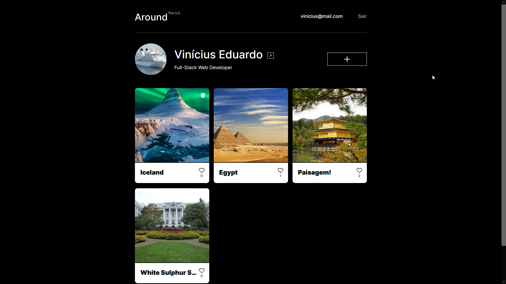
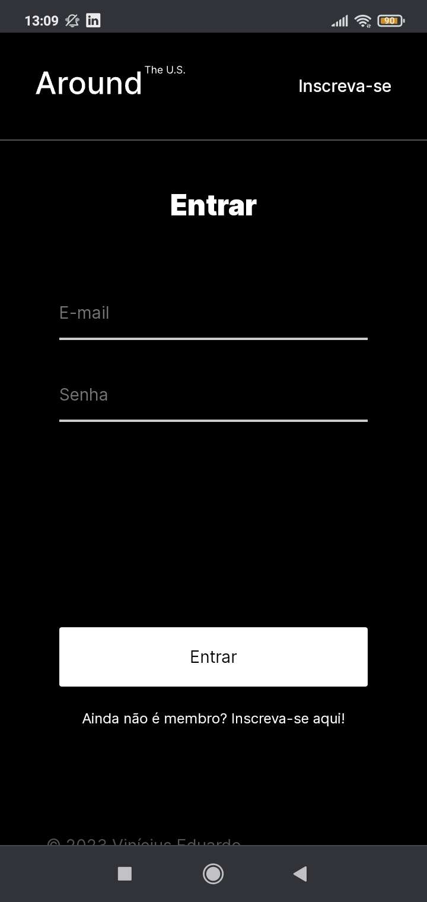
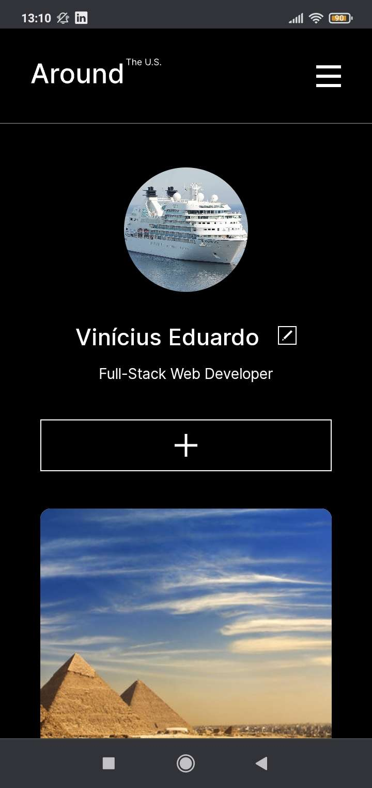
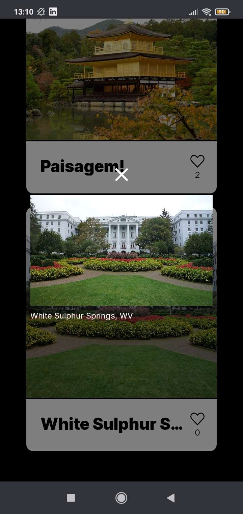

# Around the US - Full API

  

## About

A single page application where users can post photos and like photos uploaded by other users, made using React and Express.

This project is an improvement of the [Around React](https://github.com/anynoise00/around-react) project, it still uses React for the front-end, but now some routes are protected from users that are not logged in. The back-end was made using Express, and while doing it, I learned about CORS, JWT and password encryption.

This project was made for TripleTen's online web development bootcamp.

### Click [here](https://aroundtheus.anynoise.dev/) to visit the website.

## Mobile layout

  

## Technologies

The following tools where used for building this project:

- [React](https://reactjs.org/)
- [Express](https://expressjs.com/)
- HTML, CSS & JavaScript
- BEM methodology

## Credits

This projects uses [TripleTen](https://tripleten.com/)'s figma template  
?type=design&node-id=0-1&mode=design&t=ClOh3EiGpuWKWXEn-0>)
